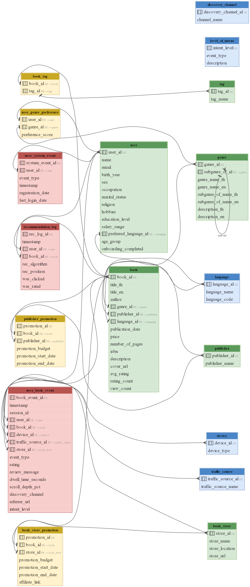

# Chapter 3: System Design and Data Architecture

บทนี้อธิบายการออกแบบระบบโดยรวม ตั้งแต่ database schema, data generation pipeline จนถึง merged tables ที่เตรียมไว้สำหรับแต่ละ recommendation algorithm

## 3.1 System Architecture Overview

```
+-------------------------------------------------------------+
|                    Greed Route Platform                      |
|  +----------+  +----------+  +----------+  +----------+     |
|  | Browse   |  | My       |  |Community |  | Search   |     |
|  | & Rec    |  | Books    |  |          |  |          |     |
|  +----+-----+  +----+-----+  +----+-----+  +----+-----+     |
|       |              |              |              |         |
|  +----v--------------v--------------v--------------v----+    |
|  |              user_book_event (Fact Table)             |    |
|  |  genre_view -> preview -> view_details -> wishlist   |    |
|  |  -> read_start -> read_complete -> rate_review       |    |
|  |  -> purchase -> share                                |    |
|  +------------------------+-----------------------------+    |
|                           |                                  |
|  +------------------------v-----------------------------+    |
|  |            Recommendation Engine                     |    |
|  |  +-------------+ +-------------+ +-------------+    |    |
|  |  |Collaborative| |Content-Based| | Popularity  |    |    |
|  |  | Filtering   | | Filtering   | |  Baseline   |    |    |
|  |  +------+------+ +------+------+ +------+------+    |    |
|  |         +----------+----+               |            |    |
|  |              +-----v------+             |            |    |
|  |              |   Hybrid   |<------------+            |    |
|  |              +-----+------+                          |    |
|  |                    |                                 |    |
|  |              +-----v--------+                        |    |
|  |              |recommendation|                        |    |
|  |              |    _log      |                        |    |
|  |              +--------------+                        |    |
|  +------------------------------------------------------+    |
+-------------------------------------------------------------+
```

## 3.2 Database Schema Design

ฐานข้อมูลออกแบบตาม **Star Schema** โดยมี fact table `user_book_event` เป็นจุดศูนย์กลาง ล้อมรอบด้วย dimension tables 17 ตาราง แบ่งเป็น 4 กลุ่ม:

### 3.2.1 Dimension Tables (Lookup)

ตารางอ้างอิงขนาดเล็กที่เก็บค่าคงที่:

| Table | Rows | Description |
|---|---:|---|
| `language` | 5 | ภาษาที่รองรับ: Thai, English, Japanese, Chinese, Korean |
| `device` | 3 | อุปกรณ์: mobile, desktop, tablet |
| `traffic_source` | 9 | แหล่งที่มา: app, website, email, social media, direct |
| `level_of_intent` | 9 | ระดับ intent ของ event (level 0–8) |
| `discovery_channel` | 8 | ช่องทางค้นพบหนังสือภายในแพลตฟอร์ม |

### 3.2.2 Core Entity Tables

| Table | Rows | Description |
|---|---:|---|
| `genre` | 117 | 24 genres หลัก + 93 subgenres (hierarchical self-referential FK) |
| `publisher` | 51 | สำนักพิมพ์ไทยและต่างประเทศ |
| `book_store` | 12 | ร้านหนังสือ: SE-ED, Naiin, Kinokuniya, Amazon, Ookbee ฯลฯ |
| `tag` | 57 | tag อิสระ: bestseller, award-winner, page-turner, adapted-to-film ฯลฯ |
| `user` | 1,000 | ผู้ใช้พร้อม demographic profile ครบถ้วน |
| `book` | 6,000 | หนังสือพร้อม title (TH/EN), description, author, price, aggregates |

### 3.2.3 Bridge / Junction Tables

| Table | Rows | Description |
|---|---:|---|
| `book_tag` | ~24,000 | Many-to-many: book -- tag (2-6 tags per book) |
| `user_genre_preference` | ~2,700 | Genre preferences จาก onboarding (2–5 genres per user) |
| `publisher_promotion` | 120 | โปรโมชันจากสำนักพิมพ์ |
| `book_store_promotion` | 60 | โปรโมชันจากร้านหนังสือ |

### 3.2.4 Fact / Event Tables

| Table | Rows | Description |
|---|---:|---|
| **`user_book_event`** | **~200,000+** | **Primary fact table** — interaction sequence per user-book pair |
| `recommendation_log` | 50,000 | ทุก recommendation ที่ serve ให้ user พร้อม CTR/rating outcome |
| `user_system_event` | ~30,000 | register / login / logout events |

### 3.2.5 ER Diagram



ER Diagram แสดง foreign key relationships ระหว่างทุกตาราง โดยใช้สีแยกกลุ่ม:
- [Blue] **สีน้ำเงิน:** Dimension (lookup) tables
- [Green] **สีเขียว:** Core entity tables
- [Yellow] **สีเหลือง:** Bridge / Junction tables
- [Red] **สีแดง:** Fact / Event tables

## 3.3 Data Generation Pipeline

เนื่องจากเป็น prototype จึงใช้ข้อมูลจำลอง (synthetic data) ที่ออกแบบให้สมจริง ด้วย Python notebook `data_generation_rev02.ipynb`

### 3.3.1 LLM-Assisted Content Generation

ใช้ **Google Gemini API** (`gemini-2.5-flash-lite`) สำหรับ:

1. **Book titles & descriptions** (Step 5) — สร้าง 6,000 ชื่อหนังสือ (TH/EN), ชื่อผู้แต่ง และ book blurb ภาษาไทย แยกตาม genre
2. **Thai review messages** (Step 10) — สร้างรีวิวภาษาไทย 500–1,000 ตัวอักษรต่อเรื่อง สอดคล้องกับ rating (1–5 ดาว) และเนื้อหาของหนังสือ

**Prompt design:** แต่ละ batch ส่งบริบทของหนังสือ (title, genre, price, description snippet) พร้อม sentiment guide ตาม rating เพื่อให้ review สมจริงและเชื่อมโยงกับเนื้อหาจริง

### 3.3.2 Realistic Interaction Sequences

ข้อมูล `user_book_event` ถูกสร้างด้วย behavioral model:

- **Intent distribution** ต่อ user-book sequence กำหนดว่าแต่ละ journey จะหยุดที่ intent ระดับไหน:
  - 40% หยุดที่ `view_details` (intent 2)
  - 25% -> `add_to_wishlist` (intent 3)
  - 15% -> `read_start` (intent 4)
  - 10% -> `read_complete` (intent 5)
  - 5% -> `rate_review` (intent 6)
  - 3% -> `purchase` (intent 7)
  - 2% -> `share` (intent 8)

- **Temporal patterns:** event timestamps มี evening bias (18:00–23:00) และ weekend bias
- **Sessions:** แต่ละ sequence มี session_id ที่เชื่อมโยง events ภายใน visit เดียวกัน
- **Dwell time & scroll depth:** realistic ranges ต่อ event type

### 3.3.3 Data Validation

หลังสร้างข้อมูลเสร็จ มีการ validate ครอบคลุม:

- [PASS] FK integrity -- ทุก foreign key อ้างอิงถึง record ที่มีอยู่จริง
- [PASS] Intent sequencing -- ไม่มี gap ใน intent sequence ต่อ user-book pair
- [PASS] Conditional NULLs -- `rating` เฉพาะ `rate_review`, `store_id` เฉพาะ `purchase`

## 3.4 Merged / Analytical Tables

จาก 18 base tables สร้าง **6 merged tables** ที่ denormalize ข้อมูลสำหรับแต่ละ recommendation use case:

### 3.4.1 merged_user_book_interaction

| Item | Detail |
|---|---|
| **Joins** | user_book_event + user + book + genre + device + traffic_source |
| **Rows** | ~200,000+ |
| **Columns** | ~30 |
| **ใช้สำหรับ** | Collaborative Filtering (implicit signals), EDA, Funnel Analysis |

### 3.4.2 merged_book_features

| Item | Detail |
|---|---|
| **Joins** | book + genre + publisher + language + tags (57 one-hot columns) |
| **Rows** | 6,000 |
| **Columns** | ~70+ |
| **ใช้สำหรับ** | Content-Based Filtering, Book Similarity Computation |

### 3.4.3 merged_user_profile

| Item | Detail |
|---|---|
| **Joins** | user + language + reading stats (aggregated from events) + rating stats + purchase count + top-3 preferred genres |
| **Rows** | 1,000 |
| **Columns** | ~25 |
| **ใช้สำหรับ** | User Segmentation, Cold-Start Handling, Demographic-Aware Recommendations |

**Key aggregated features:**
- `total_events`, `unique_books`, `unique_sessions`
- `max_intent_reached`, `avg_intent_level`, `avg_dwell_seconds`
- `books_rated`, `avg_rating`, `rating_std`
- `books_purchased`, `top_3_preferred_genres`

### 3.4.4 merged_rec_performance

| Item | Detail |
|---|---|
| **Joins** | recommendation_log + user demographics + book + genre |
| **Rows** | 50,000 |
| **Columns** | ~20 |
| **ใช้สำหรับ** | Algorithm Evaluation, A/B Testing, CTR Analysis |

### 3.4.5 user_book_ratings_long

| Item | Detail |
|---|---|
| **Format** | (user_id, book_id, rating) triples |
| **ใช้สำหรับ** | SVD, ALS, NMF, KNN — input สำหรับ Surprise / implicit library |

### 3.4.6 user_book_rating_matrix

| Item | Detail |
|---|---|
| **Format** | Pivoted user × book sparse matrix |
| **Shape** | 1,000 users × ~2,500+ books |
| **Sparsity** | > 99% |
| **ใช้สำหรับ** | Matrix Factorization (SVD, ALS, NMF) |

## 3.5 Website Prototype Design

เว็บแอปพลิเคชัน **Greed Route** เป็น static HTML prototype จำนวน 14 หน้า ออกแบบให้แสดงการทำงานของระบบแนะนำ:

### 3.5.1 Site Map

```
Greed Route
+-- index.html                -- News Feed / Updates / Recommendations
+-- mybooks.html              -- Currently Reading / Read / Want to Read
+-- Browse
|   +-- browse-rec.html       -- Personalized recommendations by genre
|   +-- browse-choice.html    -- Choice Awards
|   +-- browse-new.html       -- New releases with filters
|   +-- browse-list.html      -- Curated lists (Listopia)
|   +-- browse-explore.html   -- Random picks + Trending
|   +-- browse-news.html      -- News & Interviews
+-- Community
|   +-- community-groups.html -- Reading groups
|   +-- community-discuss.html-- Discussion threads
|   +-- community-quotes.html -- Popular quotes
+-- about.html
+-- contact.html
+-- faq.html
```

### 3.5.2 Recommendation Touchpoints on the Website

ระบบแนะนำถูกฝังในหลายจุดของเว็บไซต์:

| หน้า | Recommendation Type | Algorithm |
|---|---|---|
| **หน้าแรก** (tab "แนะนำ") | Recommended for You | Hybrid (Collaborative + Content) |
| **หน้าแรก** (tab "สำรวจ") | Trending Now | Popularity-Based (time-decayed) |
| **browse-rec.html** | Personalized by Genre | Collaborative + Content-Based |
| **browse-new.html** | New + Popular | Popularity-Based + Recency |
| **browse-explore.html** | Random Picks + Trending | Random + Popularity |
| **browse-choice.html** | Best of Year by Genre | Aggregated ratings |

### 3.5.3 User Onboarding & Genre Selection

เมื่อผู้ใช้ลงทะเบียนครั้งแรก ระบบจะแสดง **Genre Selection Modal** ให้เลือก 2–5 หมวดหมู่ที่สนใจ ข้อมูลนี้จะถูกเก็บใน `user_genre_preference` table และใช้เป็น cold-start signal สำหรับ Content-Based Filtering

### 3.5.4 Book Detail & Interaction Flow

เมื่อคลิกหนังสือ ระบบแสดง **Book Detail Modal** พร้อมข้อมูล:
- ปกหนังสือ, ชื่อ, ผู้แต่ง, หมวดหมู่
- คะแนนเฉลี่ย, จำนวนรีวิว
- ปุ่ม: อยากอ่าน / กำลังอ่าน / อ่านแล้ว / ให้คะแนน
- ลิงก์ซื้อหน้งสือ

ทุก interaction ถูกบันทึกเป็น `user_book_event` พร้อม intent_level, dwell_time, scroll_depth

---

\newpage
